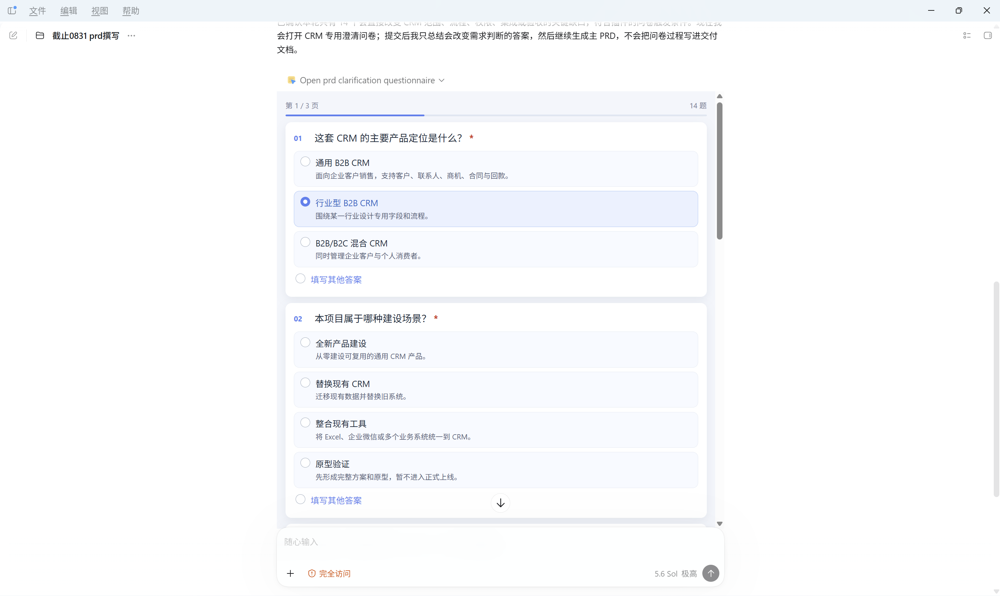
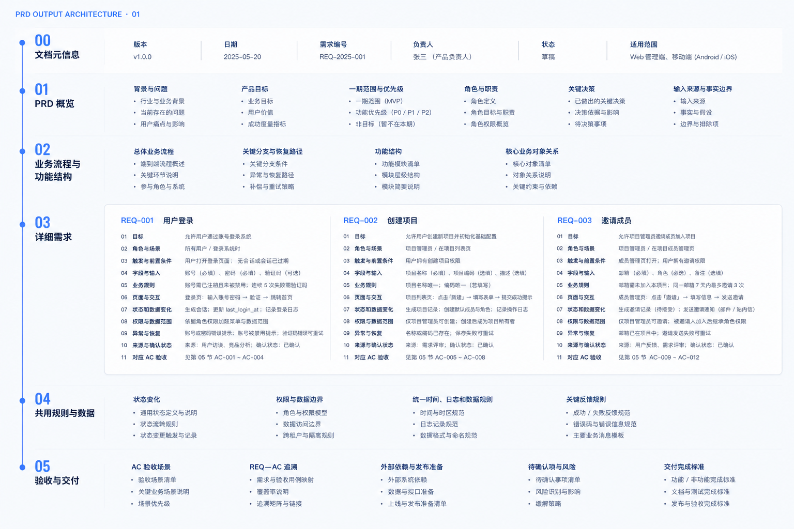
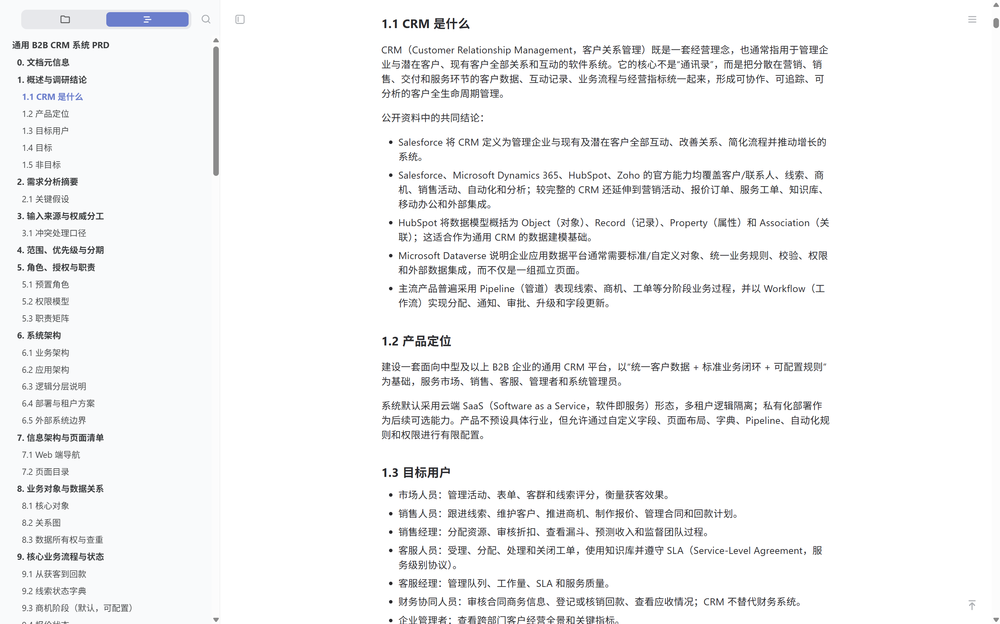
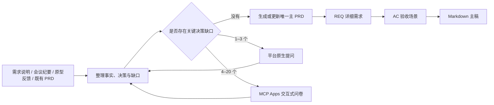

# 交互式 PRD 需求文档撰写

[](https://github.com/lin96008-maxlin/prd-outputs-interactive/actions/workflows/ci.yml)
[](./LICENSE)
[](./plugins/prd-outputs-interactive/.codex-plugin/plugin.json)
[](./plugins/prd-outputs-interactive/.mcp.json)
[](#最终交付是什么)

把需求说明、会议纪要、笔记、截图、原型反馈和既有 PRD 整理成一份可实现、可验收、可持续更新的产品需求文档。

材料充分时，Plugin 直接生成或更新主 PRD；存在多个会改变范围、角色、流程、权限、数据口径或验收方式的关键缺口时，先在 Codex 对话中打开交互式问卷集中确认，再继续撰写。普通展示细节和可以从材料直接判断的内容不会被做成问卷。

**核心定位：一份主 PRD，把背景、业务流程、详细需求、共用规则、验收和交付边界放在同一条可追溯链路中。**

## 核心价值

- **减少来回追问**：1–3 个关键问题使用平台原生提问；4–20 个相互关联的问题通过 MCP Apps 问卷集中确认。
- **只维护一份主稿**：新建 PRD 使用明确命名，更新已有 PRD 时直接回写原文件，不维护多份“最终版”。
- **业务要求与验收对应**：关键需求使用 `REQ-###`，验收场景使用 `AC-###`，研发和测试可以直接定位。
- **控制事实边界**：字段必填、默认值、操作角色、批量失败策略和指标公式没有来源时，不补成已确认规则。
- **按业务过程组织内容**：页面、字段、状态、权限和异常进入对应详细需求，共用规则集中记录，减少跨章节重复。
- **支持已有 PRD 持续更新**：可以收敛多来源分歧、用户反馈、原型变化和既有系统核对结果。

## 功能展示

> 以下截图使用演示数据，仅用于展示 Plugin 的交互与输出能力。

### 在对话中集中确认关键决策

问卷直接显示在 Codex 对话中，支持单选、多选和可自动增高的文字回答。问题和选项均采用单列布局，长内容自然换行；翻页后自动定位到当前页首题。



### PRD 文档架构

默认 PRD 采用“概览—业务流程—详细需求—共用规则—验收与交付”的阅读顺序。大型产品可以在详细需求中继续按业务模块分章，但不把内部分析方法写进最终文档。



### 真实长文档阅读效果

下图展示一份通用 B2B CRM PRD 在 Markdown 阅读器中的实际效果。大型 PRD 可以保留完整目录、调研依据、业务架构、页面规格、数据规则和验收场景；结构会根据当前需求动态展开。



## 工作方式



问卷只收集会改变主体判断的答案。提交后，答案进入当前对话上下文，Plugin 更新事实和决策，再继续原来的分析或 PRD 撰写流程。

## 主要能力

| 领域 | 能力 |
| --- | --- |
| 需求分析 | 区分有效事实、已确认决策、假设、待确认项和来源分歧 |
| 交互式澄清 | 4–20 个关键问题集中问卷；MCP Apps 不可用时自动返回完整文本问题 |
| 新建 PRD | 从需求材料生成一份 Markdown 主稿，并使用统一文件命名 |
| 更新 PRD | 识别当前主稿，将新决策回写对应正文、规则和验收 |
| 业务组织 | PRD 概览、业务流程与功能结构、详细需求、共用规则与数据、验收与交付 |
| 规格深度 | 角色、场景、触发、字段、规则、状态、权限、异常、恢复和数据范围 |
| 需求追溯 | `REQ → 来源 → 当前规格 → AC` 对应关系 |
| 多来源处理 | 收敛既有 PRD、会议、原型、系统和用户反馈之间的分歧 |
| 既有系统核对 | 按页面、接口、字段、状态、权限和操作记录保持、调整、新增、停用或待确认 |
| Word 导出 | 用户明确要求时，从 Markdown 主稿导出同内容 DOCX |

## 安装

### 环境要求

- 已安装并可使用 Codex；
- 已安装 Git；
- 已安装 Node.js 20 或更高版本，用于本地 MCP Server。

### 克隆并安装 Marketplace

```bash
git clone https://github.com/lin96008-maxlin/prd-outputs-interactive.git
cd prd-outputs-interactive
codex plugin marketplace add .
codex plugin add prd-outputs-interactive@bettle-juice
```

安装成功后请新建 Codex 任务，使新的 Skill 和 MCP 工具进入当前任务上下文。

更新版本时：

```bash
git pull
codex plugin add prd-outputs-interactive@bettle-juice
```

## 使用方式

### 根据需求材料新建 PRD

```text
使用 $prd-outputs-interactive，读取 C:\path\to\需求材料.md，生成一份可供产品、研发和测试评审的 PRD。
```

材料中存在多个关键缺口时，Plugin 会先打开问卷；信息充分时直接生成，不为使用问卷而制造问题。

### 更新已有 PRD

```text
使用 $prd-outputs-interactive，根据本轮会议纪要和原型反馈更新 C:\path\to\现有PRD.md。
```

更新会直接写回当前主稿，并同步修改对应详细需求、共用规则、验收场景和待确认项。

### 只做需求分析

```text
使用 $prd-outputs-interactive，只分析这些材料的范围、关键决策、冲突和风险，暂不创建 PRD 文件。
```

## PRD 默认结构

```text
00 文档元信息
01 PRD 概览
02 业务流程与功能结构
03 详细需求（REQ-###）
04 共用规则与数据
05 验收与交付（AC-###、依赖、发布、待确认项和风险）
```

章节会随需求规模调整。字段、状态、页面、通知和异常优先跟随对应 `REQ`，多个需求共同使用的规则才进入共用章节。

## 最终交付是什么

默认生成一份 Markdown 主稿：

```text
requirements/<需求主题>/<YYYYMMDD><需求主题>PRD-v1.md
```

例如：

```text
requirements/任务中心移动端/20260901任务中心移动端PRD-v1.md
```

更新已有 PRD 时沿用原路径和文件名，不自动创建平行版本。用户明确要求 Word 时，在主稿旁导出同名 `.docx` 文件。

## 什么时候会打开问卷

问卷只用于会明显改变以下内容的缺口：

- 本期范围和优先级；
- 角色、职责和权限；
- 核心流程、状态变化和异常恢复；
- 数据来源、统计口径和外部系统边界；
- 验收标准和上线责任。

不会因为低风险文案、实现偏好、可从材料直接得出的结论或无关展示细节打开问卷。单次最多 20 个问题。

## 适用场景

适合：

- 将需求说明、会议纪要、调研材料、截图或零散笔记整理为正式 PRD；
- 需要先集中确认多个关键决策，再继续写文档；
- 根据原型反馈或新会议结论更新已有 PRD；
- 多来源材料存在分歧，需要形成当前有效口径；
- 既有系统或源码改造，需要区分现状、调整范围和新增能力；
- 需要把关键需求与验收场景建立可追溯关系。

不负责：

- 生成高保真原型或重新设计业务 UI；
- 代替项目管理工具维护排期和研发任务；
- 在没有材料依据时补造字段、权限、状态、接口或指标；
- 自动发布、部署或修改生产系统。

## 数据边界

- 本地 MCP Server 使用 stdio 与 Codex 通信，不开放公网端口。
- 问卷内容和答案不写入磁盘，只进入当前对话上下文。
- 不应在问卷或 PRD 中填写密码、密钥、Token、身份证件和支付凭据。
- 生成的 PRD 可能包含完整业务规则和内部材料，外发前请检查接收范围和脱敏情况。

## 目录结构

| 路径 | 用途 |
| --- | --- |
| `.agents/plugins/marketplace.json` | Repo-local Codex Plugin Marketplace |
| `plugins/prd-outputs-interactive/.codex-plugin/` | Plugin 清单和界面元数据 |
| `plugins/prd-outputs-interactive/skills/` | PRD Skill 入口、模板、工作流和示例 |
| `plugins/prd-outputs-interactive/src/` | MCP Server 与问卷源代码 |
| `plugins/prd-outputs-interactive/assets/` | 构建后的自包含 MCP Apps 问卷 |
| `plugins/prd-outputs-interactive/scripts/` | 构建脚本和打包后的 MCP Server |
| `plugins/prd-outputs-interactive/tests/` | 协议、结构、内容和交互回归 |
| `plugins/prd-outputs-interactive/licenses/` | 第三方软件许可证 |
| `docs/images/` | README 截图和架构图 |
| `.github/` | 持续集成、贡献和安全说明 |

## 技术说明

- MCP Server 使用 Node.js 与 `@modelcontextprotocol/sdk`。
- 问卷使用 MCP Apps 在 Codex 对话中呈现。
- UI、样式和运行脚本打包到一个自包含 HTML，不依赖 CDN 或外部图片。
- 问卷支持单选、多选、其他答案、补充说明、长文本自动增高和分页定位。
- 不支持 MCP Apps 的客户端仍会收到可直接回答的文本问题。

## 质量检查

无需安装开发依赖即可运行 14 项 Plugin 回归：

```bash
npm test --prefix plugins/prd-outputs-interactive
```

回归覆盖 MCP 工具与资源、单 HTML 自包含、问卷问题数量、选项校验、自定义答案、单列布局、文字自动增高、翻页首题定位、PRD 文件命名、直白章节和正式示例内容。

开发构建：

```bash
npm ci --prefix plugins/prd-outputs-interactive
npm run verify --prefix plugins/prd-outputs-interactive
```

GitHub Actions 会在推送和 Pull Request 时运行完整回归。

## 安全与隐私

- 不要把真实客户名称、内部系统地址、账号、密钥、Token 或未脱敏业务数据提交到公共仓库。
- 问卷答案会进入当前 Codex 对话上下文，请遵守当前项目和模型服务的数据使用要求。
- Plugin 不会自行联网调研；需要外部资料时应由用户明确要求，并对来源进行核验。
- 安全问题请通过 GitHub Private Vulnerability Reporting 私下提交，详细说明见 [SECURITY.md](./.github/SECURITY.md)。

## 参与贡献

欢迎产品经理、设计师、研发和测试人员提交真实使用场景、内容质量问题和交互改进。提交前请阅读 [贡献指南](./.github/CONTRIBUTING.md)，并确保没有包含公司专属规则或真实业务数据。

## 开源许可

本项目自研部分采用 [MIT License](./LICENSE)。第三方组件的许可证和用途见 [THIRD_PARTY_NOTICES.md](./THIRD_PARTY_NOTICES.md) 及 Plugin 内 `licenses/` 目录。
